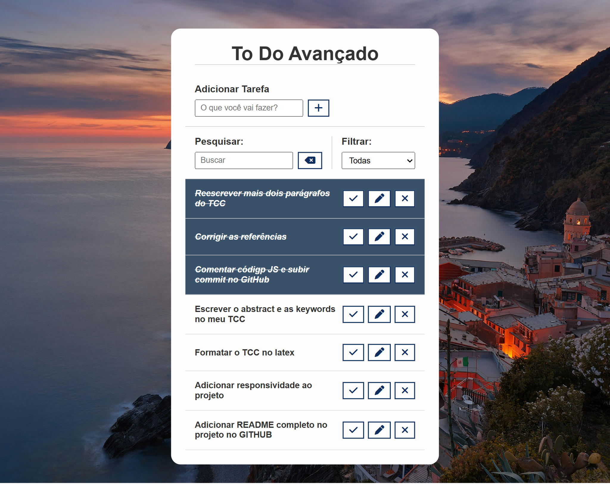
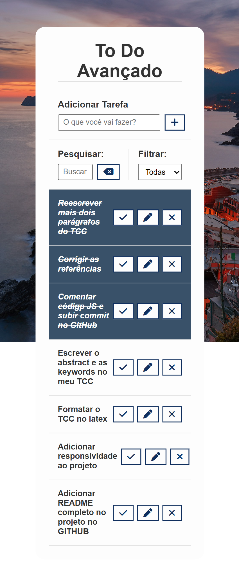

# 📝 To-Do List (Vanilla JavaScript)

An advanced to-do list application built from scratch using **HTML5**, **CSS3**, and **Vanilla JavaScript** (no frameworks or libraries, aside from Font Awesome for icons).

---

## 📸 Preview

|                    Desktop View                     |                    Mobile View                     |
| :---------------------------------------------------: | :---------------------------------------------------: |
|  |  |

---

## 🚀 Features

- **Task Management:** Add, edit, mark as done, and remove tasks.
- **Real-Time Search:** Filters the task list instantly as you type, matching against task titles.
- **Status Filter:** View all, completed, or pending tasks through a dropdown selector.
- **Data Persistence:** Tasks are saved to `localStorage`, so nothing is lost on page reload or when the browser is closed.
- **Dynamic Rendering:** Tasks are created and updated in the DOM using event delegation, since elements are generated dynamically.
- **Fully Responsive Layout:** Works seamlessly across desktop and mobile devices.

---

## 🛠️ Tech Stack

- **HTML5:** Semantic markup structure.
- **CSS3:** Custom styling, responsive layout and background handling.
- **JavaScript (ES6+):** DOM manipulation, event delegation, and `localStorage` API for data persistence.
- **Font Awesome:** Icons for task actions.

---

## 📌 Future Improvements
- [ ] Rebuild the application using **React.js**.

---

## Status

✅ Project completed.

---

## 📦 How to Run the Project Locally

### 1. Clone this repository:

```bash
git clone https://github.com/luisfrancisco2b/to-do-list-js
```

### 2. Navigate to the project folder

```bash
cd to-do-list-js
```

### 3. 🚀 Running the Project

```bash
Since this is a front-end application, you can run it directly.

Open the `index.html` file in your browser, or run it using an extension like **Live Server** in VS Code:

http://127.0.0.1:5500/index.html
```

## 👨‍💻 Author

Luis Francisco